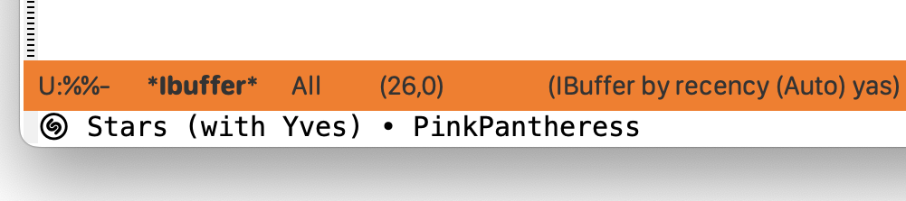

#+startup: overview nologdone
#+startup: showeverything
#+TITLE: shazam.el User Guide
#+SUBTITLE: for version {{{version}}}
#+AUTHOR: Charles Y. Choi
#+EMAIL: kickingvegas@gmail.com
#+OPTIONS: ':t toc:t author:t email:t H:4 f:t
#+LANGUAGE: en
#+MACRO: version 0.1.0-rc.1
#+MACRO: kbd (eval (org-texinfo-kbd-macro $1))
#+TEXINFO_FILENAME: shazam.info
#+TEXINFO_CLASS: casual
#+TEXINFO_HEADER: @syncodeindex pg cp
#+TEXINFO_HEADER: @paragraphindent none
#+TEXINFO_TITLEPAGE: t
#+TEXINFO_DIR_CATEGORY: Emacs misc features
#+TEXINFO_DIR_NAME: shazam
#+TEXINFO_DIR_DESC: A “Now Playing” interface for the macOS Music app.
#+TEXINFO_PRINTED_TITLE: shazam.el User Guide

Version: {{{version}}}

#+TEXINFO: Copyright © 2026 @w{Charles Y. Choi}

#+INCLUDE: "./sponsorship.org"

* Copying
:PROPERTIES:
:COPYING: t
:END:

Copyright © 2026 Charles Y. Choi

* Features
:PROPERTIES:
:CUSTOM_ID: features
:END:
#+CINDEX: Features

- Identify music with the command ~shazam~.
  
- Recognized music is added to an Org file with links to Shazam and Apple Music.

* Requirements
:PROPERTIES:g
:CUSTOM_ID: requirements
:END:
#+CINDEX: Requirements

*shazam.el* requires GNU Emacs 30.1+ running on macOS 14.2 (Sonoma) or greater.  

* Install
:PROPERTIES:
:CUSTOM_ID: install
:END:
#+CINDEX: Install

*shazam.el* is available to install from MELPA (TBD).

For manual installation, ensure that  ~shazam.el~ is available in the Emacs  ~load-path~ variable.

This package requires the installation of a macOS Shortcut named "Identify Music JSON". Download and install it on your system by clicking on the link below:

- [[https://www.icloud.com/shortcuts/bba3dd21146c4ba78dff1d7d0c0b1092][iCloud Shortcut "Identify Music JSON"]]

*shazam.el* by default requires your Emacs session to load the macOS SF Symbols font. Use the convenience command ~shazam-init~ to setup both SF Symbols and to globally set your keybinding preference to the  ~shazam~ command.

Add the following line to your Emacs initialization file:

#+begin_src elisp :lexical no
  (shazam-init "M-<f19>")
#+end_src

If no binding is desired, ~shazam-init~ can be called with no arguments.

By default, every identified track is logged in an Org file named ~shazam.org~ that is stored in your home directory. This log file can be changed to preference by the customizable variable ~shazam-log-file~.

* Usage
#+CINDEX: Usage

Identifying the current music playing is done with the command ~shazam~.

#+begin_src shell
  M-x shazam
#+end_src

#+RESULTS:

The command ~shazam-find-log~ will open the log file (specified by the variable ~shazam-log-file~) of recognized music tracks.

* Feedback & Discussion
#+CINDEX: Feedback
Please report any feedback about *shazam.el* to the [[https://github.com/kickingvegas/shazam/issues][issue tracker on GitHub]].

#+CINDEX: Discussion
To participate in general discussion about using *shazam.el*, please join the [[https://github.com/kickingvegas/shazam/discussions][discussion group]].

* Sponsorship
#+CINDEX: Sponsorship

#+INCLUDE: "./sponsorship.org"

* About
#+CINDEX: About

[[https://github.com/kickingvegas/shazam][shazam.el]] was conceived and crafted by Charles Choi in San Francisco, California.

Thank you for using *shazam.el*.

Always choose love.

* Acknowledgments
#+CINDEX: Acknowledgments

Shazam is a trademark of Apple Inc., registered in the U.S. and other countries and regions.

* Main Index
:PROPERTIES:
:INDEX:    cp
:END:

Index for this user guide.

* Variable Index
:PROPERTIES:
:INDEX:    vr
:END:

Variables, functions, commands, and menus referenced by this user guide.
